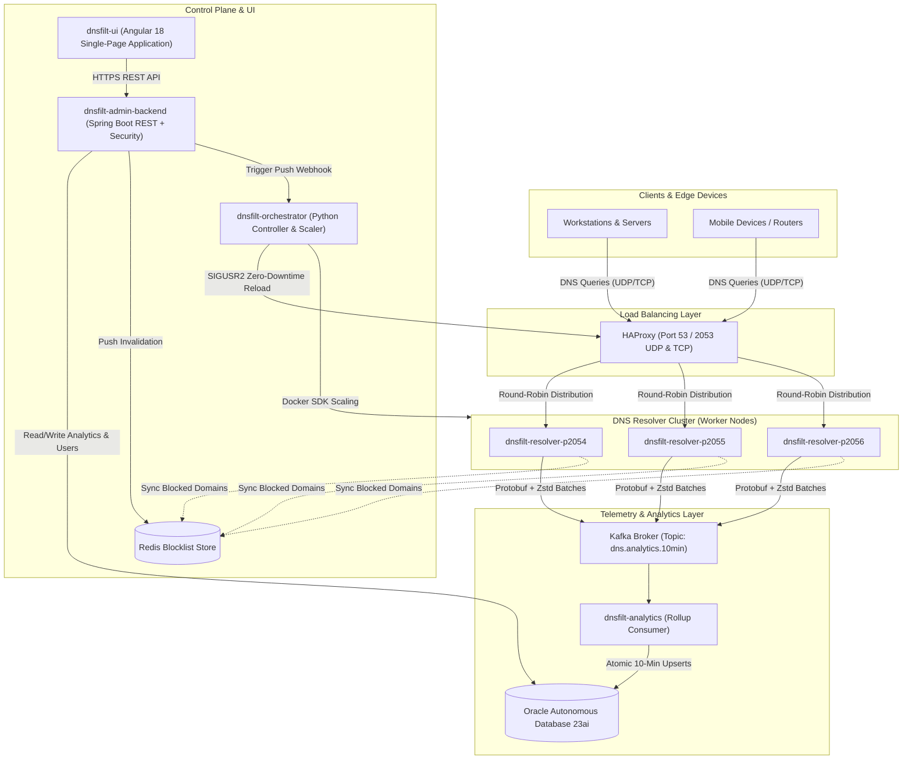

# 🛡️ DNSFilt: Distributed Cloud-Native DNS Firewall & Real-Time Analytics Engine

[](https://github.com/ikaushikpal/dnsfilt)
[](LICENSE)
[](https://openjdk.org/projects/jdk/21/)
[](https://spring.io/projects/spring-boot)
[](https://angular.dev/)
[](https://hub.docker.com/u/ikaushikpal)

**DNSFilt** is a high-throughput, enterprise-grade, distributed DNS firewall, policy engine, and analytics platform. Built with Java 21 Virtual Threads (Project Loom), Kafka streaming, Zstandard Protobuf batching, Oracle Autonomous Database 23ai, and an automated Python controller with zero-downtime HAProxy load balancing.

---

## 👋 A Note from the Author

> Hi! I'm **Kaushik**, the developer behind **DNSFilt**. I built this project to explore high-throughput distributed systems, Java 21 virtual threads, stream-processing analytics rollups, and production-grade zero-downtime orchestration — all running on a modern cloud architecture.
>
> 🔍 **I am currently looking for new software engineering opportunities.** If you find this project interesting, innovative, or well-engineered, and your company is hiring (or you can provide a referral), I would genuinely appreciate connecting with you. Feel free to reach out via GitHub or connect with me directly on [**LinkedIn**](https://www.linkedin.com/in/ikaushikpal).
>
> ⭐ *Every star, issue, discussion, PR, or referral means a lot — thank you for stopping by!*

---

## 🧭 Table of Contents

- [What is DNSFilt?](#-what-is-dnsfilt)
- [Why DNSFilt? (Design Motivation)](#-why-dnsfilt-design-motivation)
- [System Architecture](#-system-architecture)
- [Microservices Overview](#-microservices-overview)
- [How to Run (Quickstart)](#-how-to-run-quickstart)
- [Troubleshooting & Common Gotchas](#-troubleshooting--common-gotchas)
- [License](#-license)

---

## 💡 What is DNSFilt?

DNSFilt is an end-to-end protective DNS gateway that sits between client devices and the upstream internet. It intercepts DNS queries on port 53 / 2053 (UDP/TCP), checks them against an in-memory cached rule engine with sub-millisecond latency, logs real-time security events into an event streaming pipeline, and provides an administrative interface for threat intelligence, custom domain overrides, and dynamic cluster auto-scaling.

### Key Capabilities:
- **⚡ Sub-Millisecond Filtering**: Powered by Java 21 virtual threads and Caffeine L1 in-memory caches, capable of handling 50,000+ QPS per node.
- **🔒 Dynamic Threat Blocking**: Real-time domain and category blocking with atomic Redis pub/sub synchronization.
- **📊 10-Minute Batch Analytics**: High-throughput Kafka ingestion compressing telemetry via Protobuf + Zstandard (Zstd) and aggregating rollups into Oracle Autonomous Database 23ai.
- **🔄 Zero-Downtime Rolling Upgrades**: Custom Python orchestrator managing HAProxy reload via native `SIGUSR2` socket signals.
- **🎨 Glassmorphic Single-Page Application**: Angular 18 frontend with live UTC synchronization, threat explorer, real-time node scaling controls, and self-service credential management.

---

## 🎯 Why DNSFilt? (Design Motivation)

| Challenge | Traditional Approach | DNSFilt Solution |
|---|---|---|
| **High Concurrency Overhead** | Heavy OS threads (1MB stack per thread) limiting socket scalability. | **Java 21 Virtual Threads**: Millions of lightweight concurrent green threads with near-zero memory footprint. |
| **Telemetry Write Amplification** | Writing every single DNS query synchronously to SQL causes database connection pool exhaustion. | **Kafka + Zstd Protobuf Rollup**: Resolver batches 10-minute micro-aggregations with 95%+ compression ratio before atomic persistence. |
| **Cache Invalidation Latency** | Polling database every few minutes leaves a vulnerability window when adding new threat domains. | **Atomic Dual-Tier Caching**: Caffeine L1 in-memory cache on each resolver node invalidated instantly via Redis Pub/Sub sync. |
| **Upgrades & Scaling Downtime** | Restarting DNS resolvers causes dropped UDP queries and DNS resolution failure on client machines. | **HAProxy Zero-Downtime Rolling Scaler**: Python reconciler spawns new worker nodes on dynamic ports and triggers graceful `SIGUSR2` reloads. |

---

## 🏗️ System Architecture



---

## 📦 Microservices Overview

| Microservice | Technology Stack | Role & Responsibility |
|---|---|---|
| [`dnsfilt-resolver`](file:///Users/kaushikpal/Desktop/codes/projects/dnsfilt/dnsfilt-resolver) | Java 21, Netty/NIO, Caffeine, Jedis, Kafka | Core high-throughput UDP/TCP DNS resolution and policy enforcement engine. |
| [`dnsfilt-analytics`](file:///Users/kaushikpal/Desktop/codes/projects/dnsfilt/dnsfilt-analytics) | Spring Boot 3, Spring Kafka, Zstd-JNI, Oracle JDBC | Consumes compressed analytics batches, aggregates 10-minute metrics, and saves to Oracle DB. |
| [`dnsfilt-admin-backend`](file:///Users/kaushikpal/Desktop/codes/projects/dnsfilt/dnsfilt-admin-backend) | Spring Boot 3, Spring Security, JWT, Oracle ATP | Central administrative REST API, SuperAdmin RBAC, and static host for the Angular UI. |
| [`dnsfilt-orchestrator`](file:///Users/kaushikpal/Desktop/codes/projects/dnsfilt/dnsfilt-orchestrator) | Python 3.11, FastAPI, APScheduler, Docker SDK | Autonomous cluster reconciler, HAProxy configuration generator, and rolling upgrade manager. |
| [`dnsfilt-ui`](file:///Users/kaushikpal/Desktop/codes/projects/dnsfilt/dnsfilt-ui) | Angular 18 (Signals), TailwindCSS, Chart.js | Responsive administrative dashboard, live UTC clock, threat explorer, and cluster scaling UI. |
| [`dnsfilt-render-proxy`](file:///Users/kaushikpal/Desktop/codes/projects/dnsfilt/dnsfilt-render-proxy) | NGINX Alpine | Production edge reverse proxy with SSL termination and WebSocket/HTTP upgrade support. |

---

## 🚀 How to Run (Quickstart)

### 1. Prerequisites
- Docker Engine 24+ or Podman 5+
- Java 21 JDK & Gradle 8+
- Node.js 20+ & npm

### 2. Clone the Repository
```bash
git clone https://github.com/ikaushikpal/dnsfilt.git
cd dnsfilt
```

### 3. Launch with Docker Compose
Each microservice includes its own production `docker-compose.yml`:

```bash
# 1. Start Admin Backend (Port 9090)
cd dnsfilt-admin-backend && docker compose up -d --build

# 2. Start Core DNS Resolver (Port 2053)
cd ../dnsfilt-resolver && docker compose up -d --build

# 3. Start Kafka Analytics Ingestor (Port 9091)
cd ../dnsfilt-analytics && docker compose up -d --build

# 4. Start Autonomous Cluster Orchestrator (Port 9095)
cd ../dnsfilt-orchestrator && docker compose up -d --build
```

Access the Web UI in your browser at: **`http://localhost:9090`** (or your server's mapped domain).

---

## 🔧 Troubleshooting & Common Gotchas

### 1. `ConfigException: No resolvable bootstrap urls given in bootstrap.servers`
- **Cause**: Container internal DNS could not resolve `kafka-server` or `host.docker.internal` on Linux.
- **Fix**: Verify `extra_hosts` is present in `docker-compose.yml`:
  ```yaml
  extra_hosts:
    - "kafka-server:host-gateway"
    - "host.docker.internal:host-gateway"
  ```
  If using an SSH tunnel, ensure the tunnel is listening on all interfaces (`ssh -g -L 0.0.0.0:9092:...`).

### 2. `sqlite3.OperationalError: unable to open database file` in Orchestrator
- **Cause**: Restricted root permissions on the host directory mounted to `/app/data`.
- **Fix**: Grant write permissions on the host:
  ```bash
  sudo mkdir -p /opt/platform/dnsfilt/dnsfilt-orchestrator/data
  sudo chmod -R 777 /opt/platform/dnsfilt/dnsfilt-orchestrator/data
  ```

### 3. Browser Shows Old UI After Updating
- **Cause**: Browser aggressive caching of JavaScript chunk hashes or cached Docker image layer.
- **Fix**: 
  1. Pull the fresh image on prod: `sudo docker pull ikaushikpal/dnsfilt-admin-backend:latest`
  2. Perform a hard refresh in the browser: `Ctrl + Shift + R` (Windows/Linux) or `Cmd + Shift + R` (Mac).

---

## 📄 License

This project is licensed under the [MIT License](LICENSE).
Feel free to use, modify, and distribute this codebase in your own projects!
