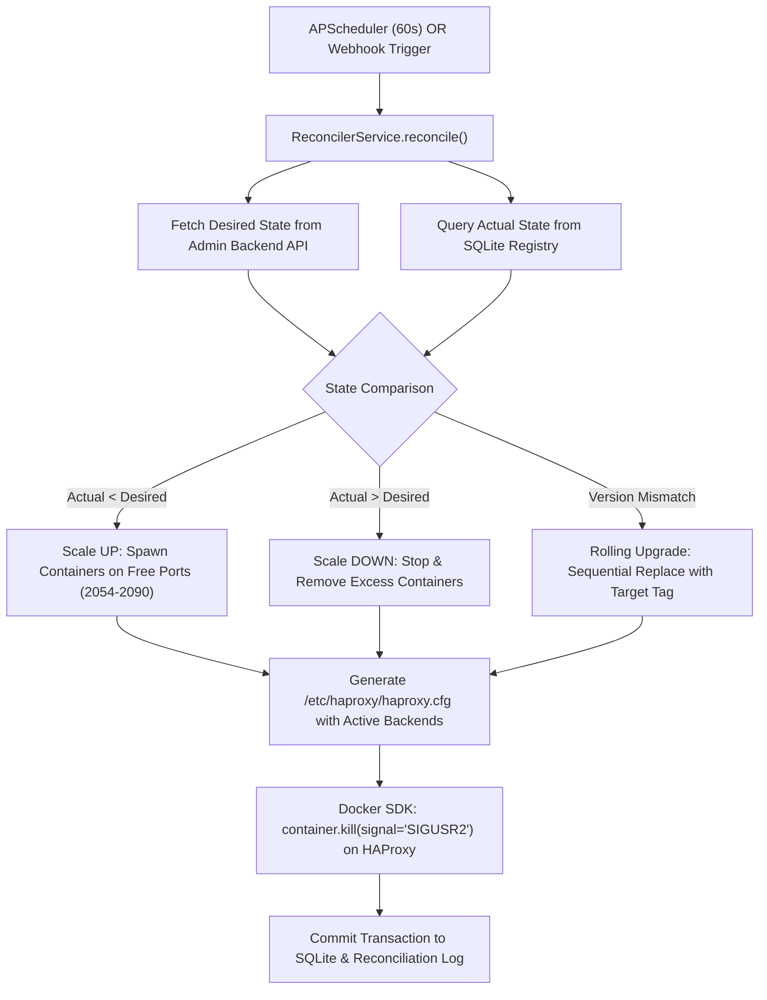

# 🎛️ dnsfilt-orchestrator: Autonomous Cluster Controller & HAProxy Scaler

[](https://www.python.org/)
[](https://fastapi.tiangolo.com/)
[](https://github.com/agronholm/apscheduler)
[](https://docker-py.readthedocs.io/)
[](https://www.haproxy.org/)

`dnsfilt-orchestrator` is the autonomous cluster management, container scaling, and load-balancer reconciliation controller for DNSFilt. Written in **Python 3.11** and **FastAPI**, it orchestrates the lifecycle of worker resolver nodes and dynamically generates HAProxy routing tables.

---

## 👋 A Note from the Author

> Hi! I'm **Kaushik**, the developer behind **DNSFilt**. I built `dnsfilt-orchestrator` to provide Kubernetes-style declarative reconciliation and zero-downtime rolling upgrades in a lightweight, self-contained Python architecture without the operational overhead of a full K8s control plane.
>
> 🔍 **I am currently looking for new software engineering opportunities.** If your organization is building distributed systems, developer tools, or cloud infrastructure, let's connect on [**LinkedIn**](https://www.linkedin.com/in/ikaushikpal).
>
> ⭐ *Every star ⭐, issue, or referral means a lot — thank you!*

---

## 💡 What is `dnsfilt-orchestrator`?

`dnsfilt-orchestrator` continuously ensures that the actual running state of the DNS resolver fleet matches the desired state configured by administrators. It runs a 60-second reconciliation loop (or reacts instantly to push webhooks from the backend), scales worker containers dynamically between ports `2054` and `2090`, updates HAProxy backend definitions, and issues graceful `SIGUSR2` signals for seamless zero-downtime reloads.

### Core Capabilities:
- **🔄 Declarative Reconciliation Loop**: Compares target replica count and software version against local SQLite registry.
- **⚡ Zero-Downtime Rolling Upgrades**: Spawns updated version containers one-by-one, verifies socket responsiveness, and gracefully stops deprecated instances.
- **🛡️ Dynamic HAProxy Load Balancing**: Generates `/etc/haproxy/haproxy.cfg` on-the-fly and signals HAProxy via the native Docker Python SDK.
- **🔍 Multi-Host Endpoint Discovery**: Automatically resolves the admin backend across internal bridge networks, Docker host gateways, and private subnets.

---

## 🔁 Reconciliation Architecture



---

## 🚀 How to Run

### 1. Configuration (`.env`)
Create a `.env` file in `dnsfilt-orchestrator/`:

```dotenv
ORCHESTRATOR_PORT=9095

# Backend API URL for Desired State Queries
BACKEND_API_URL=http://10.0.0.78:9090/api/v1

# SQLite State Registry
SQLITE_DB_PATH=sqlite:///./data/resolvers.db

# HAProxy Configuration Targets
HAPROXY_CONFIG_PATH=/etc/haproxy/haproxy.cfg
HAPROXY_CONTAINER_NAME=haproxy

# Resolver Scaling Settings
RESOLVER_IMAGE_NAME=ikaushikpal/dnsfilt-resolver
RESOLVER_PORT_RANGE_START=2054
RESOLVER_PORT_RANGE_END=2090
DOCKER_NETWORK=bridge

# Resolver Environment Injection Path
RESOLVER_ENV_FILE=/app/resolver.env

# 14-Day Rolling Log Retention
LOG_DIR=/app/logs
LOG_RETENTION_DAYS=14

# Periodic Loop Interval
RECONCILE_INTERVAL_SECONDS=60
```

### 2. Run with Docker
```bash
# 1. Ensure required host folders exist
sudo mkdir -p /opt/platform/dnsfilt/dnsfilt-orchestrator/data /var/log/dnsfilt/dnsfilt-orchestrator /opt/platform/dnsfilt/haproxy
sudo touch /opt/platform/dnsfilt/haproxy/haproxy.cfg
sudo chmod -R 777 /opt/platform/dnsfilt/dnsfilt-orchestrator/data /var/log/dnsfilt/dnsfilt-orchestrator

# 2. Run the container
sudo docker run -d \
  --name dnsfilt-orchestrator \
  --restart unless-stopped \
  --privileged \
  -p 9095:8000 \
  --add-host kafka-server:host-gateway \
  --add-host host.docker.internal:host-gateway \
  -v /var/run/docker.sock:/var/run/docker.sock:z \
  -v /opt/platform/dnsfilt/haproxy/haproxy.cfg:/etc/haproxy/haproxy.cfg:z \
  -v /opt/platform/dnsfilt/dnsfilt-orchestrator/data:/app/data:z \
  -v /var/log/dnsfilt/dnsfilt-orchestrator:/app/logs:z \
  -v /opt/platform/dnsfilt/dnsfilt-resolver/.env:/app/resolver.env:ro \
  --env-file /opt/platform/dnsfilt/dnsfilt-orchestrator/.env \
  ikaushikpal/dnsfilt-orchestrator:latest
```

---

## 🔧 Troubleshooting Guide

### 1. `PermissionError(13, 'Permission denied')` on `/var/run/docker.sock`
- **Cause**: Podman or Docker socket requires root permissions.
- **Fix**: Run the container with `--privileged` and append the `:z` volume flag (`-v /var/run/docker.sock:/var/run/docker.sock:z`).

### 2. `statfs /opt/platform/dnsfilt/haproxy/haproxy.cfg: no such file or directory`
- **Cause**: In Podman, mounting a file requires the file to exist on the host before running.
- **Fix**: Create the empty placeholder file on the host:
  ```bash
  sudo mkdir -p /opt/platform/dnsfilt/haproxy && sudo touch /opt/platform/dnsfilt/haproxy/haproxy.cfg
  ```

### 3. `sqlite3.OperationalError: unable to open database file`
- **Cause**: Root directory permissions on the host data folder.
- **Fix**: Run `sudo chmod -R 777 /opt/platform/dnsfilt/dnsfilt-orchestrator/data`. The service also includes automated fallback to `/tmp/resolvers.db` to prevent crashes.

---

## 📄 License
Licensed under the [MIT License](../LICENSE).
